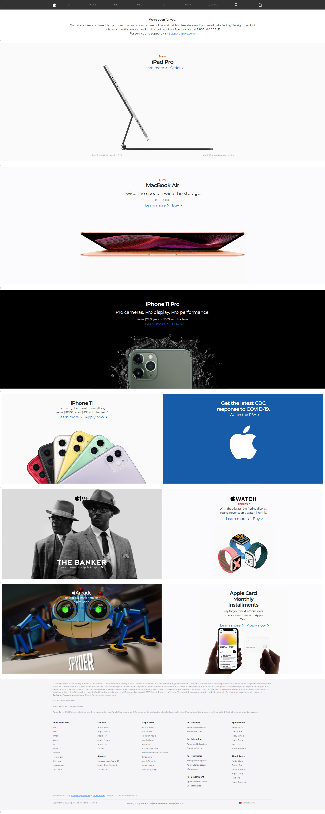
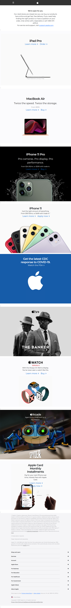

# 🍎 Apple Homepage UI Clone (Full-Stack Version)

This project is a **responsive Apple homepage clone** built using **React (Vite)** and **Bootstrap** for the frontend, extended into a **full-stack application** using **Express.js** and **MySQL** for backend data management.

The application follows a clean, scalable, and component-based architecture using React functional components. The frontend is structured into reusable components, while the backend provides dynamic data through RESTful APIs connected to a MySQL database.

Styling is implemented using a combination of Bootstrap and custom CSS to closely replicate Apple’s modern UI design. The typography uses the Montserrat Google Font, and icons are integrated using Font Awesome to maintain a clean and scalable interface.

This project demonstrates modern frontend development, backend API integration, database management, and full-stack application architecture fundamentals.

---

## 🏗️ Project Architecture

This project follows a **full-stack architecture** consisting of:

### 🔹 Frontend (Client Side)

- Built with React (Vite)
- Uses React Router for client-side routing
- Organized into reusable functional components
- Styled with Bootstrap and custom CSS

### 🔹 Backend (Server Side)

- Built with Express.js
- Provides RESTful API endpoints
- Handles HTTP requests and responses
- Connects to a MySQL database

### 🔹 Database Layer

- Uses MySQL for structured data storage
- Stores product information dynamically
- Supplies data to the frontend through backend APIs

The frontend retrieves product data dynamically from the Express server instead of hardcoding it, making the application data-driven and partially full-stack.

---

## 🛠️ Technologies Used

### 🎨 Frontend

- React (JavaScript)
- Vite
- Bootstrap
- HTML5
- CSS3
- React Router DOM
- Google Fonts (Montserrat)
- Font Awesome

### ⚙️ Backend

- Node.js
- Express.js

### 🗄️ Database

- MySQL

---

## 🚀 Features

### ⚛️ Frontend Features

- Built with React (Vite) for fast development and optimized builds
- Component-Based Architecture using reusable functional components
- Fully Responsive Design powered by Bootstrap grid system
- Custom CSS styling for detailed UI control
- Google Font integration (Montserrat) for modern typography
- Font Awesome icons for scalable UI icons
- React Router integration for seamless multi-page navigation

### ⚙️ Backend Features

- Express.js server handling API routes
- RESTful endpoints for retrieving product data
- JSON-based API responses
- Separation of frontend and backend logic

### 🗄️ Database Features

- MySQL database for structured data storage
- Relational tables for product information
- Backend-to-database connection for dynamic content rendering

---

## 📱 Responsiveness

The application is fully responsive across:

- Desktop
- Tablet
- Mobile devices

Bootstrap’s grid system and custom media queries ensure adaptive layout behavior similar to the official Apple website.

---

## 🎯 Learning Outcomes

This project demonstrates:

- Modern React development using Vite
- Client-side routing with React Router
- Backend API development with Express.js
- Database integration using MySQL
- Full-stack data flow (Database → Express API → React Frontend)
- Clean project structure and scalable architecture
- Responsive UI implementation

---

## Screenshots

### Desktop



### Small Screen



## Installation

#### Install my-project with npm

```bash
 git clone https://github.com/Kalx6/Apple-Responsive-react.git
 cd Apple-Responsive-react
 npm install
 npm run dev
```

#### Then open:

```
http://localhost:3000
```
